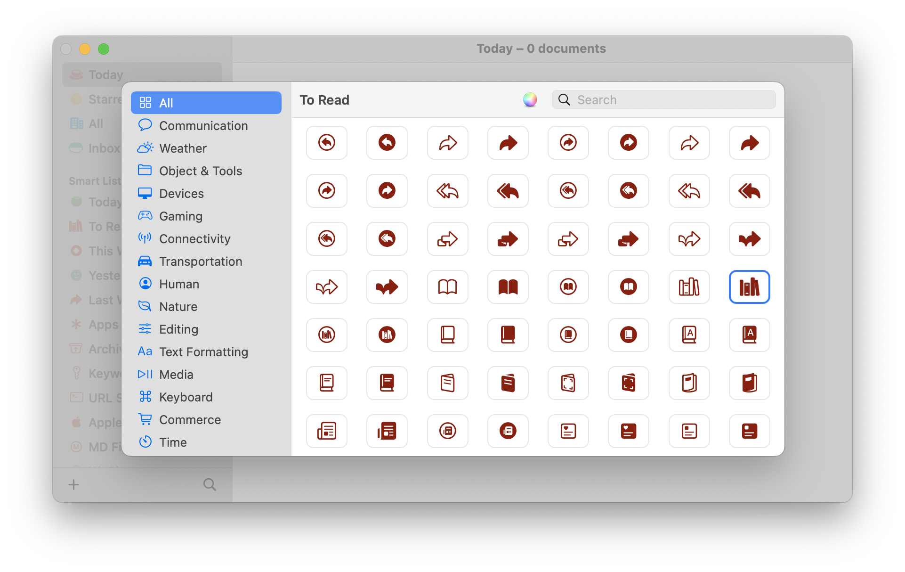

# Symbol Picker

A SF Symbols picker for Mac apps. Built with AppKit.

## Compatibility

- macOS 11.0+

## Install

Add `https://github.com/francisfeng/SymbolPicker` in the [“Swift Package Manager” tab in Xcode](https://developer.apple.com/documentation/xcode/adding_package_dependencies_to_your_app).

## Usage



1. AppKit
```swift

// in your NSViewController subclass
import SymbolPicker

@objc func pickIcon(_ sender: NSMenuItem) {
  if let windowController = SymbolPicker.windowController(
      symbol: collection.symbol,
      color: collection.color ?? .labelColor,
      delegate: self,
      title: collection.name),
     let iconSheet = windowController.window {
    
    // You need to persist this windowController in your app.
    symbolPickerWindowController = windowController
    
    window.beginSheet(iconSheet) {
      _ in
      self.symbolPickerWindowController = nil
    }
  }
}

extension ViewController: SymbolPickerDelegate {
  func symbolPicker(_ symbol: String, color: NSColor?) {
  
  }
}
```

2. SwiftUI

I haven't try it with SwiftUI yet. Any contributions will be welcome.

## Known Issues

1. Memory footprint will go up everytime the window is presented and dimissed. Too much work has went into it and I think it's now acceptable after a few symbol selections. Any contributions will be welcome.

2. The app can't be presented like a modal dialog. I don't know why. Any help will be appreciated. To mimic the experience, the window is not movable or resizable. You may also want to implement click-outside to dismiss in your app. You can do this by overriding `func mouseDown(with: NSEvent)` in your `NSWindowController` subclass.

```swift
override func mouseDown(with event: NSEvent) {
  super.mouseDown(with: event)
  if let sheetwindow = window?.attachedSheet {
    window?.endSheet(sheetwindow)
  }
}
```

## Lisense
MIT
